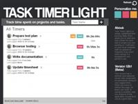

Instructions - Task Timer Light - v 1.1
=================================================

Project: https://github.com/syntaxseed/tasktimerlight

Author
---------------------
Sherri Wheeler  (SyntaxSeed.com)

Contributors
-------------------
Lauren Lund (www.LaurenLund.com)

License
----------------------
- See license.txt.

Features
----------------------
- Create multiple timers which behave like a stopwatch: start, stop, clear.
- Log times to an accumulated (logged) overall total.
- Install on a webserver with PHP to save timers.
- Simple to use and install.
- No webserver required.

Requirements (Server)
----------------------
- PHP 7+, 8.0+, 8.1+
- Ability for a php script to write to a file on the web server.

Installation (Local)
-----------------------
- Extract the project archive to a location on your computer.
- Open the page index.html in your web browser.
- Get started by adding a new timer using the box in the upper right corner.
- Note: there is no saving for the local version. All timers are lost if the page is refreshed or closed.

Installation (Server)
-----------------------
- Extract the project archive to a webserver with PHP 7.2+.
- Ensure that the file timers.dat is writeable by the web server user running PHP (chmod 755 or 777).
- Open the file tasktimerlight/assets/js/tasktimerlight.js and set the variables in the configuration section.
   - (savingEnabled should be true, and serviceURL should be the web URL to the service.php file).
- Visit the index.html page in your browser.
   - Such as: http://www.example.com/tasktimerlight/index.html
- Get started by adding a new timer using the box in the upper right corner.

Usage
------------------------
- Add a new timer by entering a name for it in the box in the upper right corner.
- Click the Start button to begin timing a task.
- Click the Stop button to end or pause timing.
- Click the Clear link to reset the timer to zero without logging/saving the counter value.
- Click the Log button to add the current timer count to the logged/accumulated time. In the server edition this action will save the timer to the server.
- When saving is enabled, you can only use one instance as at a time because there can only be one set of timers (ie one person using it).
